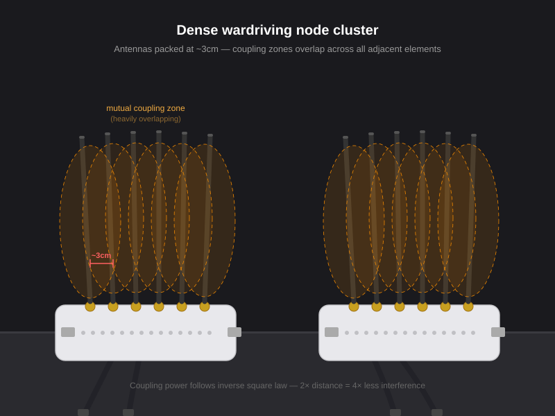

# Antenna spacing in dense wardriving rigs - why it matters and how to fix it

If you've seen builds like this with antennas packed 1–2cm apart on a node cluster, here's what's actually happening to your capture quality and what you can do about it without changing any hardware.



---

## The problem: mutual coupling

When two antennas are physically close, they interact with each other's electromagnetic fields. This is called **mutual coupling**, and it has real consequences:

| Effect | What it means for wardriving |
|--------|------------------------------|
| Detuning | Resonance shifts, SWR rises - an antenna that tested clean solo now behaves like a marginal unit |
| Desensitization | Adjacent radio's noise floor rises - weaker APs at range disappear from capture even with no transmitting happening |
| Pattern distortion | Null zones introduced in your receive pattern - APs in certain directions become invisible |

---

## Why distance matters more than you think: inverse square law

RF coupling drops with the **square** of distance. This means the improvement is front-loaded - you don't need to go far to see a huge gain:

| Spacing | Relative coupling power |
|---------|------------------------|
| 1 cm | 100% (baseline) |
| 2 cm | 25% |
| 4 cm | 6% |
| 8 cm | 1.6% |
| 16 cm | 0.4% |

> **There is no magic target distance. Any increase in separation is a significant improvement.**
>
> Going from 1cm to 2cm doesn't halve the coupling - it reduces it to one quarter. Going from 1cm to 4cm takes it to 6%. The biggest gains come from the smallest early increases.

This is why arguing "it still captures APs so spacing doesn't matter" misses the point. The question isn't whether it works - it's whether it could be capturing significantly more with a minor physical change.

---

## How to mitigate it without changing hardware

### 1. Alternate band assignments across adjacent nodes

If two physically adjacent radios are scanning **different bands**, their mutual coupling is far weaker - they're not tuned to the same frequency and don't interact nearly as efficiently.

**Instead of grouping all 2.4 GHz nodes together, alternate:**

```
Node 1: 2.4 GHz
Node 2: 5 GHz
Node 3: 2.4 GHz / Bluetooth
Node 4: 5 GHz
...
```

Adjacent nodes on different bands see dramatically less mutual interference. This applies to Bluetooth too - a BT-assigned radio next to a WiFi-assigned one is a much better pairing than two WiFi radios scanning the same band side by side.

### 2. Rotate alternate antennas 90°

Rotating every other antenna 90° (one vertical, one horizontal) reduces coupling by roughly **20 dB** due to polarization mismatch. The antennas are no longer aligned to couple efficiently.

```
| ↕ | ↔ | ↕ | ↔ | ↕ | ↔ |
```

This is one of the highest-impact no-cost changes you can make to a dense cluster. Some builds already do this by accident. Doing it intentionally across all adjacent pairs is better.

### 3. Physical separation where possible

Even a few extra centimeters between nodes (not just antennas) compounds with the inverse square law. If your case design allows any additional spacing, use it. You don't need to hit a specific target - just more is better, especially in the 1–5cm range where the curve is steepest.

---

## Summary

Dense node clusters optimize for a visible metric (node count) at the cost of an invisible one (per-antenna effectiveness). The nodes in those builds aren't performing as well as they would with better spacing - but since nobody measures that comparison directly, the degradation goes unnoticed.

The fixes above cost nothing and can be applied to any existing build right now. Band alternation and antenna rotation are the two highest-impact changes and require no hardware modification.
